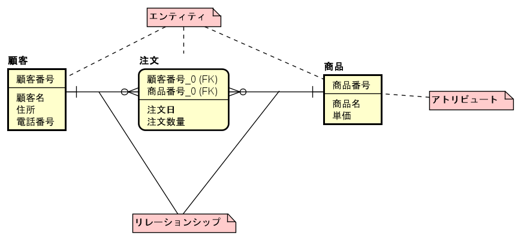
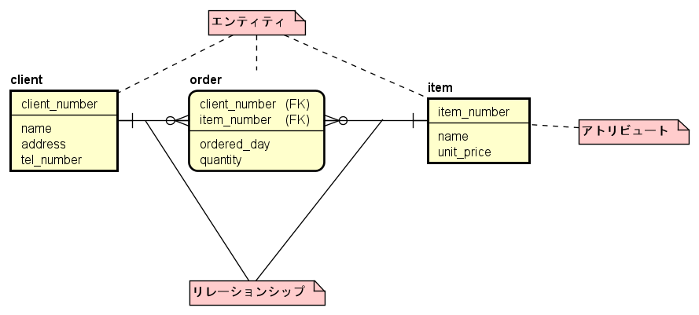

# E-R図
データベース管理システムに依存しないデータモデルとしてE-Rモデル(Entity-Relationship model)がある. そしてE-Rモデルを図で表現したものをE-R図という. ここではE-R図の構成・見方について説明する. 

## E-R図の構成
E-R図の例を次に示す.
E-R図はエンティティ, アトリビュート, リレーションシップの3つから構成される. エンティティ(実体)はデータベース化の対象となる実世界の構成要素で, 性質や特性を表すいくつかのアトリビュート(属性)をもつ. 図1の例では顧客というエンティティは顧客番号, 顧客名, 住所, 電話番号の4つのアトリビュートによって構成されている. さらにエンティティ間の関係を表したものがリレーションシップである. リレーションシップには, 1対1, 1対多, 多対多の3つの関係があるが, このうち多対多は関係データベースにおいて実現が難しいため1対多, 多対1の関係に分割する. この分割によって生じたエンティティは連関エンティティと呼ばれる. またE-R図には図1のような論理モデルと, 図2のような物理モデルの2つがある, 論理モデルはエンティティとそのリレーションシップを日本語で分かりやすく記述したものである. 実際のデータベースでは日本語は扱えないため物理モデルのように英語で記述することで実際の実装時の表記と, その意味を2つのモデルで表現している. 

図1 論理モデル

図2 物理モデル

## 独立エンティティと依存エンティティ
各エンティティのアトリビュートには, 少なくとも1つそのエンティティを一意に識別する識別子がある. これは関係データベースにおいて主キーに相当するものである. そして, 1対多のリレーションシップが存在するとき, 多側のエンティティは1側のエンティティの識別子を外部キーとして持つ. したがって, 1側のエンティティがないと存在できないようなエンティティを弱実体, 依存エンティティといい, そうでないようなエンティティを強実体, 独立エンティティという. 今の例では, 注文エンティティは顧客エンティティと商品エンティティの両方がないと存在できないため依存エンティティとなる. 仮に注文エンティティに注文番号という識別子を追加した場合は注文エンティティ単体で存在できるため独立エンティティとなる. 