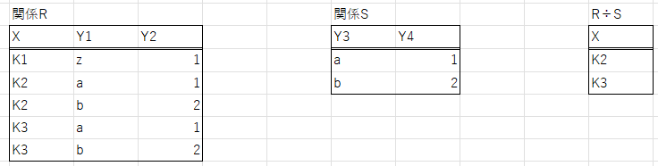

# 結合

ここでは表の結合演算について説明する. 結合例として社員表companyAと部門表departmentを用いる.
結合演算とは2つの表が共通して持つ項目を結合して新しい表を作り出す操作のことである. 
```
companyA
+-------+--------------+------------+
| code  | name         | group_code |
+-------+--------------+------------+
| 11001 | 中川夏紀     | E01        |
| 11002 | 吉川優子     | E02        |
+-------+--------------+------------+

department
+------------+------------+
| group_code | group_name |
+------------+------------+
| E01        | 1組        |
| E02        | 2組        |
+------------+------------+
```


## 自然結合
一般に結合演算はselect文とfrom文で複数の表名を
指定し, where文で条件の絞り込みを行う. 特に条件が等結合であるような結合を等結合という. 等結合は直積演算を行ったのちにwhere文で
条件を絞り, select文で見かけ上の重複を取り除くという流れで行われる. このように重複する結合列を取り除くようにした結合を自然結合という.
自然結合の例を次に示す.

```sql
select code, name, companyA.group_code, group_name
from companyA, department
where companyA.group_code = department.group_code;
```

```
+-------+--------------+------------+------------+
| code  | name         | group_code | group_name |
+-------+--------------+------------+------------+
| 11001 | 中川夏紀     | E01        | 1組        |
| 11002 | 吉川優子     | E02        | 2組        |
+-------+--------------+------------+------------+
```

## 内部結合
先の自然結合の操作のような, 結合列の値が等しい行だけを取り出す結合演算は内部結合で実現できる. 内部結合のクエリと実行結果を次に示す. 

```sql
select code, name, companyA.group_code, group_name
from companyA
inner join department
on companyA.group_code = department.group_code;
```

```
+-------+--------------+------------+------------+
| code  | name         | group_code | group_name |
+-------+--------------+------------+------------+
| 11001 | 中川夏紀     | E01        | 1組        |
| 11002 | 吉川優子     | E02        | 2組        |
+-------+--------------+------------+------------+
```

## 外部結合
内部結合に対して, 結合列が一致しない行も取り出すことができる演算を外部結合という. 外部結合では対応する表に結合要素がない場合にはNULLを結合する. このため基準にする表によって左外部結合, 右外部結合, 完全外部結合の3つの外部結合方法がある. 
ここでは表comnapyAおよび表departmentに次のようにデータを加えて外部結合の例を示す.
```
+-------+-----------------+------------+
| code  | name            | group_code |
+-------+-----------------+------------+
| 11001 | 中川夏紀        | E01        |
| 11002 | 吉川優子        | E02        |
| 11003 | 傘木希美        | E02        |
| 11004 | 鎧塚みぞれ      | J01        |
+-------+-----------------+------------+
```

```
+------------+------------+
| group_code | group_name |
+------------+------------+
| E01        | 1組        |
| E02        | 2組        |
| E03        | 3組        |
+------------+------------+
```

### 左外部結合
左外部結合は結合する左の表(ここではcompanyA)を基準に右の表(部門表)にして, 右の表に存在しない行はNULLとして結合する方法である. 左外部結合のクエリと実行結果を次に示す. J01に対応するdepartmentの要素がないため, NULLとして結合が行われている.
```sql
select code, name, companyA.group_code, group_name
from companyA
left join department
on companyA.group_code = department.group_code;
```

```
+-------+-----------------+------------+------------+
| code  | name            | group_code | group_name |
+-------+-----------------+------------+------------+
| 11001 | 中川夏紀        | E01        | 1組        |
| 11002 | 吉川優子        | E02        | 2組        |
| 11003 | 傘木希美        | E02        | 2組        |
| 11004 | 鎧塚みぞれ      | J01        | NULL       |
+-------+-----------------+------------+------------+
```

### 右外部結合
右外部結合は右の表(deapartment)を基準にして, 左の表(companyA)に存在しない行はNULLとして結合する方法である. 右外部結合のクエリとその実行結果を次に示す.
```sql
select code, name, companyA.group_code, group_name
from companyA
right join department
on companyA.group_code = department.group_code;
```

```
+-------+--------------+------------+------------+
| code  | name         | group_code | group_name |
+-------+--------------+------------+------------+
| 11001 | 中川夏紀     | E01        | 1組        |
| 11002 | 吉川優子     | E02        | 2組        |
| 11003 | 傘木希美     | E02        | 2組        |
| NULL  | NULL         | NULL       | 3組        |
+-------+--------------+------------+------------+
```

### 完全外部結合
完全外部結合は片方の表にのみ存在するデータは, もう片方のデータをNULLとして結合を行う方法である. 完全外部結合はmysqlでは対応していない.

## 商
商は, ある関係R(X, Y1, Y2)とS(Y3, Y4)についてS(Y3, Y4)のすべての行がR(Y1, Y2)に含まれる場合に対応するR(X)を求める演算である. 商の例を次に示す.

