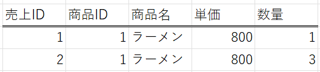
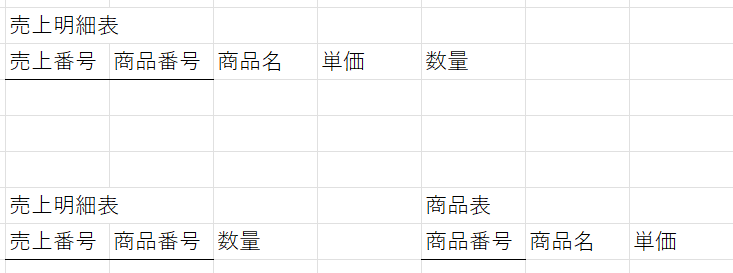

# 正規化と関数従属
あるアトリビュートxが決まると, 他のアトリビュートyが一意に決まる関係を関数従属といい, 「x→y」で表す. そしてxを独立属性, yを従属属性という. 1つの表内の属性間に生じる関数従属性を整理することを正規化という. ここでは関数従属の種類と正規化の方法について説明する.

## 関数従属
ここでは部分関数従属, 完全関数従属, 推移的関数従属の3つについて説明する.

### 部分関数従属
「x→y」の関係において, yがxの真部分集合にも関数従属するとき, yはxの部分関数従属であるという. 独立属性xの2つの要素$x_1$, $x_2$について, $\{ x_1, x_2 \}→y$が成立して, かつ$x_1→y$もしくは$x_2→y$のどちらかが成り立つとき$\{ x_1, x_2 \}$と$y$の間に部分関数従属が存在する.   
ex) 次のような表を考える. 
  
この表において, 売上ID, 商品ID, 商品名に注目すると, {売上ID, 商品ID}→商品名が成立して, かつ商品ID→商品名が成立するから{売上ID, 商品ID}と商品名の間に部分関数従属が存在する.

### 完全関数従属
「x→y」の関係において, yがxのどの真部分集合にも関数従属しないとき, これを完全関数従属という. 独立属性が1つの属性で構成される場合には必ず完全関数従属となる.  
ex) 先の表の例において, 数量は売上IDと商品IDの2つによって一意に定まるため, {売上ID, 商品ID}と数量の間には完全関数従属が存在する. 

### 推移的関数従属
3つの属性x, y, zについて, 「x→y」, 「y→z」, 「y→xが成立しない」が成り立つとき, zはxに推移的関数従属しているという. さらに「z→yが成立しない」が成り立つときzはxに完全推移的関数従属しているという.   
ex) 次に示す表を考える.  
  
この表では, 売上番号から顧客番号が一意に定まり, 顧客番号から顧客名が一意に定まる. 一方で顧客番号から売上番号は一意に定まらないため「売上番号→顧客番号」, 「顧客番号→顧客名」, 「顧客番号→売上番号は成立しない」という関係をみたすから顧客名は売上番号に推移的関数従属である.  

## 正規化
ここでは第1正規化から第3正規化までの3つの正規化について説明する.

### 第1正規化
表中の繰り返し部分を排除する操作を第1正規化といい, その結果得られた表を第1正規形という. 
第1正規形となった表は基本的には関係データベースに定義することができるが, データが冗長であるためこのままではデータ操作時に不具合が生じることがあり, これを更新時異常という. 更新時異常には次に説明するように修正時異常や挿入時異常, 削除時異常がある.

- 修正時異常 : 例えば売上番号, 商品番号, 商品名, 単価, 数量から構成される表があったときに商品名の1つを「リンゴA」から「リンゴB」のように変更するときには, 該当する行をすべて変更しなければいけないため, 1行でも変更し忘れるとデータに不整合が生じる. このような異常を修正時異常という.

- 挿入時異常 : 先の例で売上番号と商品番号の複合キーになっている場合は売上がない, すなわち売上番号がない商品を登録することができない. このように挿入時に生じる異常を挿入時異常という. 

- 削除時異常 : 先の例において売上実績が1つしかない商品の売り上げデータを削除した場合はその商品自体の情報も消えてしまう. このようにデータ削除時に生じる異常を削除時異常という. 

### 第2正規化
更新時異常を防ぐために, 第1正規形の表にさらに処理を行う. さらに関数従属とデータの重複を排除することも第2正規化, 第3正規化を行う. 第2正規化では第1正規形の表について, 候補キーの一部に部分関数従属する非キー属性を別の表に分解する. 第2正規化の例を次に示す.
  
この例では売上明細表を第2正規化して売上明細表と商品表に分解している. 正規化前の売上明細表は売上番号と商品番号2つの候補キーで, 商品名は{売上番号, 商品番号}に部分関数従属である. そこで売上番号と商品番号を候補キーとする売上明細表と商品番号を候補キーとする商品表の2つに分解して部分関数従属を排除している. 

### 第3正規化
第3正規化は第2正規形の表に対して行われる操作であり, 候補キーに推移的関数従属している非キー属性を別の表に分解する. 第3正規化の例を次に示す.
  
この例では「売上番号→顧客番号」, 「顧客番号→顧客名」の関係があるから顧客番号は売上番号に推移的関数従属している. これより売上表を売上表と顧客表の2つの表に分解して推移的関数従属性を排除している. 

### 正規化の注意点
正規化を行うことで表が分割されるためデータを取り出すときは結合が必要である. このため正規化を行った関係データベースを扱うと処理時間が長くなる. したがって更新時異常が少ない場合や処理時間が要求されるような場合は正規化を行わない, あるいは正規化したものをもとに戻す非正規化を行うことがある. 