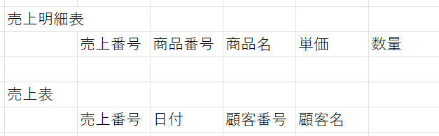

# 正規化と関数従属
あるアトリビュートxが決まると, 他のアトリビュートyが一意に決まる関係を関数従属といい, 「x→y」で表す. そしてxを独立属性, yを従属属性という. 1つの表内の属性間に生じる関数従属性を整理することを正規化という. ここでは関数従属の種類と正規化の方法について説明する.

## 部分関数従属
「x→y」の関係において, yがxの真部分集合にも関数従属するとき, yはxの部分関数従属であるという. 独立属性xの2つの要素$x_1$, $x_2$について, $\{ x_1, x_2 \}→y$が成立して, かつ$x_1→y$もしくは$x_2→y$のどちらかが成り立つとき$\{ x_1, x_2 \}$と$y$の間に部分関数従属が存在する.   
ex) 次のような表を考える. 
  
この表において, 売上ID, 商品ID, 商品名に注目すると, {売上ID, 商品ID}→商品名が成立して, かつ商品ID→商品名が成立するから{売上ID, 商品ID}と商品名の間に部分関数従属が存在する.

## 完全関数従属
「x→y」の関係において, yがxのどの真部分集合にも関数従属しないとき, これを完全関数従属という. 独立属性が1つの属性で構成される場合には必ず完全関数従属となる.  
ex) 先の表の例において, 数量は売上IDと商品IDの2つによって一意に定まるため, {売上ID, 商品ID}と数量の間には完全関数従属が存在する. 

## 推移的関数従属
3つの属性x, y, zについて, 「x→y」, 「y→z」, 「y→xが成立しない」が成り立つとき, zはxに推移的関数従属しているという. さらに「z→yが成立しない」が成り立つときzはxに完全推移的関数従属しているという.   
ex) 次に示す表を考える.  
  
この表では, 売上番号から顧客番号が一意に定まり, 顧客番号から顧客名が一意に定まる. 一方で顧客番号から売上番号は一意に定まらないため「売上番号→顧客番号」, 「顧客番号→顧客名」, 「顧客番号→売上番号は成立しない」という関係をみたすから顧客名は売上番号に推移的関数従属である.  