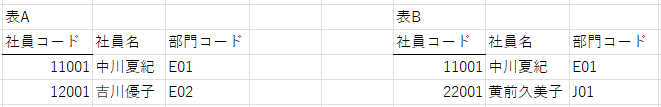

# 集合演算

ここでは集合演算と結合演算について次の2つの表を用いながら説明する.



## 和
和は集合Aと集合Bの和集合をとる演算である. 表companyAとcompanyBの和はmysqlでは次のようなクエリで演算できる. 演算結果は次の通りである.

```sql
/* 和 */
select * 
from companyA
union 
select * 
from companyB;
```

```
+-------+-----------------+------------+
| code  | name            | group_code |
+-------+-----------------+------------+
| 11001 | 中川夏紀        | E01        |
| 11002 | 吉川優子        | E02        |
| 22001 | 黄前久美子      | J01        |
+-------+-----------------+------------+
```

## 共通(和)
共通は集合Aと集合Bの共通部分をとる演算である. mysqlでは共通演算をサポートしていない．

## 差
差は集合Aと集合Bの差をとる演算である. mysqlでは差演算をサポートしていない．

## 直積演算
直積は集合Aと集合Bの要素を1つずつ対応させる演算である. 新しい表departmentを次のように定義して要素を加える. このとき, 直積演算のクエリとその実行結果は次のようになる.
```sql
CREATE TABLE department (
    group_code CHAR(3) NOT NULL PRIMARY KEY,
    group_name VARCHAR(10)
);

INSERT INTO department VALUES ('E01', '1組'), ('E02', '2組');
```

```sql
select companyA.* , department.* 
from companyA 
cross join department;
```

```
+-------+--------------+------------+------------+------------+
| code  | name         | group_code | group_code | group_name |
+-------+--------------+------------+------------+------------+
| 11001 | 中川夏紀     | E01        | E01        | 1組        |
| 11002 | 吉川優子     | E02        | E01        | 1組        |
| 11001 | 中川夏紀     | E01        | E02        | 2組        |
| 11002 | 吉川優子     | E02        | E02        | 2組        |
+-------+--------------+------------+------------+------------+
```

## 選択と射影
選択は表から指定した行を取り出す演算, 射影は表から指定した列を取り出す演算である. 選択と射影の例を次に示す.
```sql
/* 選択 */
select * 
from companyA
where code = 11001;
```

```
+-------+--------------+------------+
| code  | name         | group_code |
+-------+--------------+------------+
| 11001 | 中川夏紀     | E01        |
+-------+--------------+------------+
```

```sql
/* 射影 */
select name
from companyA;
```

```
+--------------+
| name         |
+--------------+
| 中川夏紀     |
| 吉川優子     |
+--------------+
```